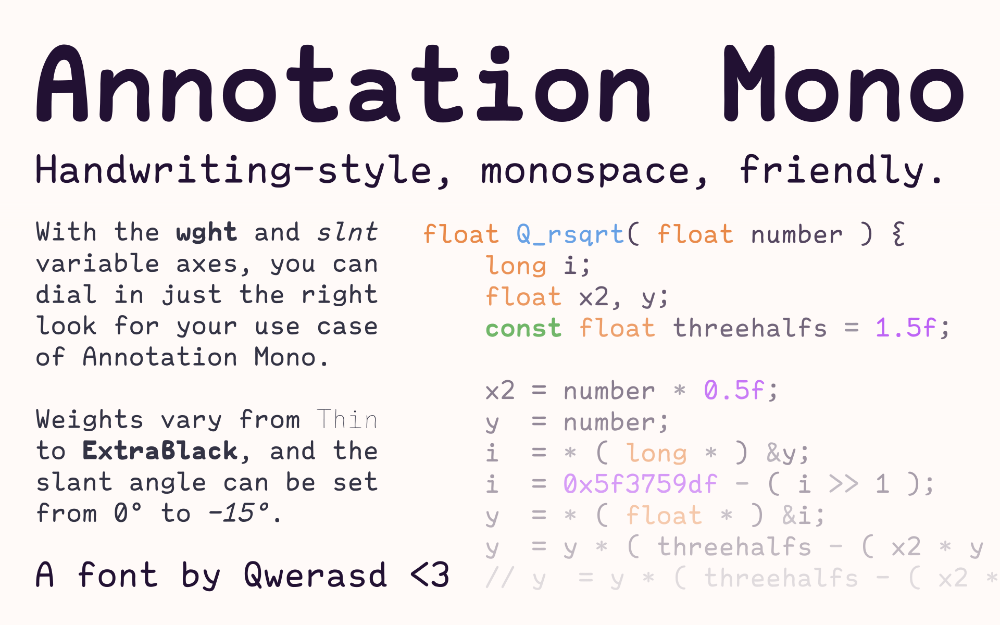

  <a href="https://github.com/qwerasd205/AnnotationMono/releases/latest">Download</a>

# Annotation Mono

Annotation Mono is a lovingly crafted handwriting-style monospace font.

Annotation Mono is an idealized handwriting; using letter forms inspired
by monospace bitmap fonts, legibility is maximized while retaining a
hand-written character.

Its variable weights make Annotation Mono ideal for a wide variety of use
cases other than code, including labels and headings. Given its hand-written
look, you could even use it for comic lettering if you want.

You can read more about the font [here](https://qwerasd205.github.io/AnnotationMono).
